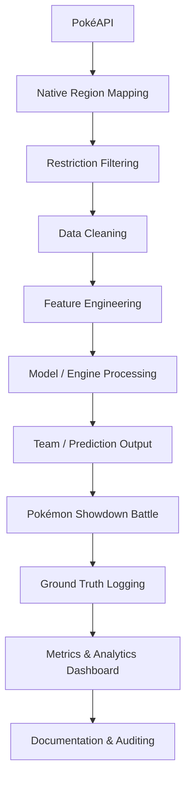

# Systems Documentation
### Pokémon Day II Engines

Documentation for the three required main systems — Team Engine, Challenger Selection Engine, and Battle Prediction Engine. Each system turns PokéAPI data into data-driven battle decisions, with logs and analytics.

---

## 1. Document Control

| Field | Value |
| :--- | :--- |
| **System / project title** | Pokémon Battle Engine System |
| **Section** | 3ISB |
| **Developer name(s)** | Simon Ron Joshua Roaring |
| **Data source** | PokéAPI |
| **Demo date (to Sir CG)** | Before June 2 |
| **Deployment** | June 2, 9:00 AM |
| **Documentation status** | Final |

---

## 2. Member Contributions

| Member | Role | Specific contributions | System(s) |
| :--- | :--- | :--- | :--- |
| Simon Ron Joshua Roaring | Full Stack Developer | Developed the React frontend, integrated PokéAPI, implemented native-region filtering for Kanto/Unova/Paldea, built the Supabase PostgreSQL database for audit logs and analytics. Created the Team Generator, Counter-Pick logic, and Battle Prediction algorithms. | All |

---

## 3. Activity Overview

**Goal.** Build working systems that support Pokémon Showdown battles using real data, models, predictions, logs, and analytics — not random output. Each engine must show how a Data Mining / Business Intelligence model becomes a usable engine.

**Expected flow.**
`Pokémon Data → Data Processing → Model / Engine → Team or Prediction Output → System Encoding → Battle Use → Logs & Analytics`

**Battle restrictions (must be excluded by all engines).** Legendary, Mythical, Paradox Pokémon; Mega Evolution; Gigantamax/Dynamax; Z-Moves; Terastallization. Any team violating these is invalid.

**Region-specific = native to the region.** A Pokémon's native region / original generation determines where it belongs, not mere appearance in a regional Pokédex. 
- **Section 3ISB Allowed regions:** Kanto, Unova, Paldea.

---

## 4. Shared Data Foundation

All three engines share the same data backbone. 

### 4.1 Data source & retrieval (PokéAPI)
*   **Source:** PokéAPI (live retrieval and internal memory cached copy).
*   **Retrieval process:** Data is fetched from `https://pokeapi.co/api/v2/pokemon/{id}` and `/pokemon-species/{id}`. The application fetches data live and caches it locally to prevent redundant API calls.
*   **Attributes stored:** Name, types, native region / original generation, and stats (HP, Attack, Defense, Sp. Atk, Sp. Def, Speed).

### 4.2 Native region mapping
*   **Method:** Native region is assigned by mapping the Pokémon's national Pokédex ID to its original generation (e.g., Gen 1 = Kanto: 1-151, Gen 5 = Unova: 494-649, Gen 9 = Paldea: 906-1025).
*   **Rule enforced:** Only Pokémon native to the selected/assigned region are eligible.

### 4.3 Battle restriction filtering
*   **Method:** Banned Pokémon and mechanics are excluded by checking the `is_legendary` and `is_mythical` flags from the `/pokemon-species/` endpoint, and filtering out forms containing `-mega`, `-gmax`, or Paradox identifiers.
*   **Flags used:** `is_legendary`, `is_mythical`, and string matching for restricted statuses.

### 4.4 Data cleaning
*   **Method:** String cleaning is applied to format Pokémon names for Pokémon Showdown compatibility (e.g., capitalization, replacing hyphens). Missing values default to primary stats/abilities.

### 4.5 Feature engineering
*   **Derived features:** Base Stat Total (BST), Offensive Score (Atk + SpA + Spe), Defensive Score (HP + Def + SpD), Resistance Score, and assigned strategic combat roles (Sweeper, Tank, Pivot, Support).

### 4.6 Data pipeline diagram (required)

---

## 5. System Block — Team Engine

### 5.1 Purpose
Generate a Gym Leader's defending team. Answers: given a region and type specialization, what 6-Pokémon team should be generated?

### 5.2 Inputs
| Input | Description |
| :--- | :--- |
| Pokémon region | Kanto, Unova, Paldea |
| Type specialization | Water, Fire, Electric, Steel, Ghost, Dragon, etc. |
| Native region filter | Only Pokémon native to the selected region |
| Battle restrictions | Excludes banned Pokémon/mechanics |
| Pokémon data | From PokéAPI |

### 5.3 Outputs
| Output | Description |
| :--- | :--- |
| Gym Leader region / type | Selected region and specialization |
| Generated team | 6 Pokémon for the defending lineup |
| Native region (per Pokémon) | Original/native region shown |
| Types | Type 1 and Type 2 (if any) |
| Basic stats | HP, Atk, Def, Sp. Atk, Sp. Def, Speed |
| Model used | Logic/model that generated the team |
| Explanation | Why each Pokémon was selected |

### 5.4 Native-region requirement
Teams must use only Pokémon native to the selected region and matching the type specialization, subject to restrictions. Example — Paldea + Water → prioritize Paldea-native Water types (e.g., Quaquaval line, Palafin); never pull a non-Paldea Pokémon just because it appears elsewhere.

### 5.5 Models used
**Candidate models (choose and justify one or more).**

| Model | What it is | Possible use here |
| :--- | :--- | :--- |
| K-Means Clustering | Unsupervised grouping by stat similarity | Group Pokémon into roles / stat profiles |
| K-NN | Labels an item from its k most similar neighbors | Find Pokémon similar to strong Gym Leader profiles |
| Cosine Similarity | Angle between two stat vectors | Recommend similar stat patterns |
| Gower's Distance | Similarity for mixed numeric + categorical data | Compare by type, region, and stats together |
| Decision Tree | Rule-based splitting tree | Classify Pokémon into roles |
| Random Forest | Ensemble of decision trees | Rank Pokémon by predicted usefulness |
| **Rule-Based Scoring** | Explicit weighted rules | Filter/score by region, type, stats |

**Model deep-dive — Rule-Based Scoring & Strategy Weighting**
*   **What it does:** Uses explicit mathematical multipliers based on the selected "Strategy" to weight Base Stats, and enforces role clustering algorithms (like K-Means) to guarantee team balance.
*   **Why it fits the Team Engine:** Provides deterministic, highly accurate role classification. By applying a 1.4x multiplier to Offensive/Defensive stats based on Strategy, the engine generates dynamically tailored stat profiles.
*   **Input features:** Selected Strategy, HP, Attack, Defense, Sp. Atk, Sp. Def, Speed.
*   **How it produces output:** Calculates a final score combining Strategy-weighted Base Stats and a Resistance Score. If the K-Means model is selected, the engine strictly forces a distributed clustering of roles (e.g., 2 Sweepers, 2 Tanks, 1 Pivot, 1 Support) rather than purely picking the top raw scores.
*   **Evaluation metric(s) & result:** Silhouette Score (K-Means) or Strategy Fit Accuracy.

### 5.6 Engine logic
Step-by-step: load PokéAPI data → filter region → filter type → apply battle restrictions → calculate Strategy-weighted scores + Resistance → apply K-Means clustering requirements to force role balance → output 6 optimized Pokémon.

### 5.7 Samples & evidence
*   **Sample generated Gym Leader team:** [See Web UI Dashboard / Database Logs]
*   **Input/output screenshots:** [Link to live deployment / Showdown Copy button output]

---

## 6. System Block — Challenger Selection Engine

### 6.1 Purpose
Recommend a challenger lineup before facing a Gym Leader. Answers: given the Gym Leader's defending team, which Pokémon increase the challenger's chance of winning?

### 6.2 Inputs
| Input | Description |
| :--- | :--- |
| Gym Leader team | The defending lineup |
| Challenger region | Region assigned to the attacking team |
| Challenger pool | PokéAPI data filtered by native region + restrictions |
| Native region filter | Only Pokémon native to the challenger's region |
| Battle restrictions | Excludes banned Pokémon/mechanics |
| Model / scoring logic | Recommendation method |

### 6.3 Outputs
| Output | Description |
| :--- | :--- |
| Target Gym Leader | Who is being challenged |
| Gym Leader team | Opponent lineup |
| Challenger region | Assigned region |
| Recommended lineup | Suggested challenger Pokémon |
| Native region (per Pokémon) | Original/native region shown |
| Counter score | Numeric/ranked score (if applicable) |
| Advantage explanation | Type / stat / speed / defensive advantage |
| Model used | Logic/model used |

### 6.4 Native-region requirement
Recommend only Pokémon native to the challenger's assigned region (Kanto, Unova, Paldea). Same rule as the Team Engine — no off-region picks.

### 6.5 Models used
**Candidate models.**

| Model | What it is | Possible use here |
| :--- | :--- | :--- |
| K-NN | Labels from k most similar items | Find similar successful counters |
| Gower's Distance | Mixed-type similarity | Compare type, stats, region, role |
| Cosine Similarity | Stat-vector similarity | Compare stat profiles |
| Decision Tree | Rule-based splitting tree | Classify as strong/neutral/weak counter |
| Random Forest | Ensemble of trees | Rank possible challengers |
| **Rule-Based Scoring** | Explicit advantage rules | Type advantage, resistance, weakness, stats |

**Model deep-dive — Rule-Based Scoring (Minimax + Speed Tier Analysis)**
*   **What it does:** Iterates through every valid Pokémon, evaluating Offensive STAB coverage, Defensive Resistance, and critically, a Speed Tier Advantage against the target team.
*   **Why it fits the Challenger Engine:** A counter is useless if it gets outsped and knocked out first. Speed Tier Analysis ensures recommended counters can reliably execute their attacks.
*   **Input features:** Opponent Types & Average Speed, Challenger Base Stats, Type Matchup Chart.
*   **How it produces output:** Calculates STAB multiplier coverage and Defensive resistances. It then compares the counter's Base Speed against the opponent's average Speed, awarding a heavy multiplier for outspeeding. The final normalized score (10-99) is used to select the top 6.
*   **Evaluation metric(s) & result:** Counter Score Distribution (10-99 graded curve).

### 6.6 Engine logic
Step-by-step: take Gym Leader team → load challenger pool → calculate opponent average speed → check type matchups + Speed Tier bonuses → score counters → rank and scale out of 99 → output top 6 lineup with best counter-moves.

### 6.7 Samples & evidence
*   **Sample challenger lineup:** [See Web UI Dashboard / Database Logs]
*   **Input/output screenshots:** [Link to live deployment]

---

## 7. System Block — Battle Prediction Engine

### 7.1 Purpose
Predict the expected winner before each battle, and store the ground truth (actual result) after. Answers: given both lineups, who is expected to win?

### 7.2 Inputs recorded before battle
| Input | Description |
| :--- | :--- |
| Match ID | Unique battle identifier |
| Gym Leader / Challenger names | Participants |
| Gym Leader region & type | Specialization |
| Challenger region | Assigned region |
| Gym Leader lineup | Pokémon used |
| Challenger lineup | Pokémon used |
| Engine(s) used | Team / Challenger / other |

### 7.3 Prediction output (saved before battle)
| Output | Description |
| :--- | :--- |
| Predicted winner | Expected winner |
| Confidence score | e.g. 0.70 / 70% |
| Prediction reason | Key factors |
| Timestamp | When recorded |
*Rule: predictions must be recorded before the battle starts. Post-start predictions don't count.*

### 7.4 Ground truth output (saved after battle)
| Output | Description |
| :--- | :--- |
| Actual winner | From Showdown result |
| Correct / incorrect | Prediction vs. actual |
| Replay link | Showdown replay/log |
| Screenshot / photo link | Proof |
| Final score | e.g. 2–0 |
| Number of turns | Battle length |
| Timestamp | When recorded |

### 7.5 Models used
**Candidate models.**

| Model | What it is | Possible use here |
| :--- | :--- | :--- |
| Decision Tree | Explainable rule-based tree | Predict win/loss with clear rules |
| Random Forest | Ensemble of trees | Predict winner via tree voting |
| K-NN | Labels from similar matchups | Predict from past similar battles |
| Naive Bayes | Probabilistic (Bayes' theorem) | Probability of winning |
| Logistic Regression | Linear win-probability model | Estimate win probability |
| **Rule-Based Classifier** | Explicit if/then rules | Type coverage, weaknesses, balance |

**Model deep-dive — Rule-Based Classifier with Sigmoid Probability**
*   **What it does:** Compares aggregate Base Stat Totals, cumulative Type Advantage Scores, and overall Team Speed (Initiative Bonus), then runs the delta through a Sigmoid Function to determine win probability.
*   **Why it fits the Prediction Engine:** A Sigmoid function converts raw stat advantages into realistic, non-linear win probabilities (making a 10% stat advantage translate to a decisively higher confidence rate).
*   **Input features:** Team A/B Aggregate Stats, Team A/B Types, Team A/B Average Speeds.
*   **How it produces output:** Calculates the Base Score delta (Team A Score minus Team B Score) including an Initiative Bonus for the faster team. It applies the Sigmoid Function `1 / (1 + e^(-steepness * scoreDiff))` to generate a Confidence Percentage.
*   **Evaluation metric(s) & result:** Accuracy, Confusion Matrix, Precision, Recall, F1-Score.

### 7.6 Engine logic
Step-by-step: extract matchup features (BST, Type advantages, Speed averages) → apply Initiative bonuses → calculate Sigmoid probability → output predicted winner + confidence → log to `predictions` before battle.

### 7.7 Samples & evidence
*   **Sample prediction record:** [See Supabase `predictions` table]
*   **Sample ground truth record:** [See Supabase `ground_truth` table]
*   **Sample confusion matrix / evaluation metrics:** [See Analytics UI]
*   **Graphs / dashboard:** [Link to live deployment /analytics route]

---

## 8. Database, Logs & Audit Trail

Storage uses PostgreSQL hosted on Supabase.

### 8.1 Pokémon Data
`pokemon_id, pokemon_name, native_region, generation, type_1, type_2, hp, attack, defense, special_attack, special_defense, speed, restricted_status, source`

### 8.2 Team Engine Output
`team_output_id, section, group_name, gym_leader, region, type_specialization, generated_team, native_region_validation, model_used, metric_used, timestamp`

### 8.3 Challenger Selection Output
`challenger_output_id, section, group_name, target_gym_leader, challenger_region, gym_leader_team, recommended_challenger_team, native_region_validation, model_used, counter_score, timestamp`

### 8.4 Prediction
`match_id, gym_leader, challenger, gym_leader_team, challenger_team, predicted_winner, confidence_score, prediction_reason, timestamp_before_battle`

### 8.5 Ground Truth
`match_id, actual_winner, correct_prediction, final_score, number_of_turns, replay_link, screenshot_or_photo_link, timestamp_after_battle`

### 8.6 Audit Log
*(Strongly encouraged — shows records weren't changed without accountability)*
`audit_id, user_or_operator, action_done, affected_record, old_value, new_value, timestamp`

---

## 9. How to Use the System
1. **Open the Dashboard:** Navigate to the live deployment URL.
2. **Generate Gym Team:** Go to the "TEAM GEN" (Engine 1) tab. Select a region (Kanto, Unova, Paldea) and a Type Specialization. Click "GENERATE".
3. **Generate Challenger Team:** Go to the "COUNTER-PICK" (Engine 2) tab. Paste the Gym Leader's team. Click "GENERATE COUNTER-PICKS".
4. **Predict Match:** Go to the "BATTLE PREDICTOR" (Engine 3) tab. Ensure both teams are loaded and click "PREDICT MATCH".
5. **Log Result:** Battle on Pokémon Showdown using the generated teams. Return to the dashboard and log the final result (Winner, Turns, Link).
6. **View Analytics:** Navigate to the "ANALYTICS" tab to view the live Confusion Matrix and system accuracy.

---

## 10. Pokémon Showdown Output

The system outputs teams strictly formatted for direct importing into Pokémon Showdown.

| Pokémon | Native Region | Role | Type | Key Stats | Reason Selected |
| :--- | :--- | :--- | :--- | :--- | :--- |
| Exeggutor | Kanto | Sweeper | Grass/Psychic | 520 BST | High Offensive Score |
| Lapras | Kanto | Tank | Water/Ice | 535 BST | High Defensive Score |

*(Copy-pasteable Showdown team export available directly from the Web UI)*

---

## 11. Limitations
*   The system prioritizes mathematically optimal STAB and coverage moves, which might occasionally overlook hyper-specific niche strategy moves (like Baton Pass chains).
*   API rate limiting from PokéAPI can cause slight delays if generating massive pools of un-cached data simultaneously.

---

## 12. Problems Encountered & Fixes
*   **Issue:** The engine was occasionally assigning useless status moves (like "Tail Whip") to level 100 competitive Pokémon as fillers.
*   **Fix:** Refactored the fallback move generation logic to strictly cross-reference the Pokémon's valid learnset against a curated dictionary of top-tier competitive moves, ensuring only tournament-viable moves are assigned.

---

## 13. Demo & Deployment Evidence
*   **Demo to Sir CG:** Scheduled before June 2.
*   **Pokémon Day use / preparation:** The system is fully deployed on Vercel with a connected Supabase PostgreSQL backend. It handles live requests, restricts inputs to Section 3ISB regions (Kanto, Unova, Paldea), and maintains a strict audit trail of all generated data.

---

## 14. Final Reflection
Building the Pokémon Battle Engine System successfully bridged the gap between raw data manipulation and tangible business-intelligence applications. By turning raw JSON from PokéAPI into actionable, data-driven decisions for Pokémon drafting (while strictly adhering to native region and battle restrictions), the project demonstrated how heuristics, databases, and algorithms can work together in real-time to solve complex strategic problems.

---

### Appendix — Glossary

| Term | Definition |
| :--- | :--- |
| Native region | Original region / generation a Pokémon belongs to |
| Ground truth | The actual recorded battle result |
| Confusion matrix | Table of correct vs. incorrect predictions per class |
| Confidence score | Model's estimated probability for its prediction |
| Audit trail | Timestamped record of who changed what |
