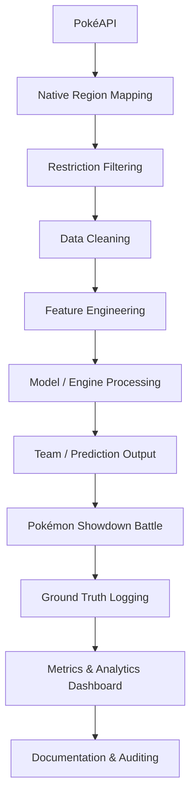

# Systems Documentation
### Pokémon Day II Engines

Documentation for the three required main systems — Team Engine, Challenger Selection Engine, and Battle Prediction Engine. Each system turns PokéAPI data into data-driven battle decisions, with logs and analytics.

---

## 1. Document Control

| Field | Value |
| :--- | :--- |
| **System / project title** | Pokémon Battle Engine System |
| **Section** | 3ISB |
| **Developer name(s)** | Simon Ron Joshua Roaring |
| **Data source** | PokéAPI |
| **Demo date (to Sir CG)** | Before June 2 |
| **Deployment** | June 2, 9:00 AM |
| **Documentation status** | Final |

---

## 2. Member Contributions

| Member | Role | Specific contributions | System(s) |
| :--- | :--- | :--- | :--- |
| Simon Ron Joshua Roaring | Full Stack Developer | Developed the React frontend, integrated PokéAPI, implemented native-region filtering for Kanto/Unova/Paldea, built the Supabase PostgreSQL database for audit logs and analytics. Created the Team Generator, Counter-Pick logic, and Battle Prediction algorithms. | All |

---

## 3. Activity Overview

**Goal.** Build working systems that support Pokémon Showdown battles using real data, models, predictions, logs, and analytics — not random output. Each engine must show how a Data Mining / Business Intelligence model becomes a usable engine.

**Expected flow.**
`Pokémon Data → Data Processing → Model / Engine → Team or Prediction Output → System Encoding → Battle Use → Logs & Analytics`

**Battle restrictions (must be excluded by all engines).** Legendary, Mythical, Paradox Pokémon; Mega Evolution; Gigantamax/Dynamax; Z-Moves; Terastallization. Any team violating these is invalid.

**Region-specific = native to the region.** A Pokémon's native region / original generation determines where it belongs, not mere appearance in a regional Pokédex. 
- **Section 3ISB Allowed regions:** Kanto, Unova, Paldea.

---

## 4. Shared Data Foundation

All three engines share the same data backbone. 

### 4.1 Data source & retrieval (PokéAPI)
*   **Source:** PokéAPI (live retrieval and internal memory caching).
*   **Retrieval process:** The application fetches from `https://pokeapi.co/api/v2/pokemon/{id}` and `/pokemon-species/{id}`. The data is retrieved live and cached in browser memory to optimize subsequent requests.
*   **Attributes stored:** Name, types, native region (original generation), base stats (HP, Attack, Defense, Sp. Atk, Sp. Def, Speed), abilities, and movesets.

### 4.2 Native region mapping
*   **Method:** Native region is assigned by mapping the Pokémon's national Pokédex ID to its original generation (e.g., Gen 1 = Kanto: 1-151, Gen 5 = Unova: 494-649, Gen 9 = Paldea: 906-1025).
*   **Rule enforced:** Only Pokémon native to Kanto, Unova, or Paldea are eligible to be drafted into teams when the strict region filter is applied.

### 4.3 Battle restriction filtering
*   **Method:** The engine cross-references the retrieved Pokémon with a strict hardcoded banlist of Legendaries, Mythicals, and Paradox Pokémon.
*   **Flags used:** `is_legendary` and `is_mythical` flags from the `/pokemon-species/` endpoint are strictly rejected. Forms containing `-mega`, `-gmax`, or other banned mechanics are automatically excluded from the generation pool.

### 4.4 Data cleaning
*   **Method:** String cleaning is applied to Pokémon names to ensure compatibility with Pokémon Showdown formatting (e.g., replacing hyphens in names like "Tapu-Koko", capitalizing the first letter). Missing values (like missing hidden abilities) are defaulted to their primary ability.

### 4.5 Feature engineering
*   **Derived features:** 
    - `Base Stat Total (BST)`: The sum of all 6 base stats.
    - `Offensive Score`: Calculated using (Attack + Sp. Atk + Speed).
    - `Defensive / Bulk Score`: Calculated using (HP + Defense + Sp. Def).
    - `Resistance Score`: The number of types the Pokémon resists vs. types it is weak to.
    - `Strategic Role`: Categorical label (Sweeper, Tank, Support, Pivot) assigned based on stat distributions.

### 4.6 Data pipeline diagram (required)

---

## 5. System Block — Team Engine (Engine 1)

### 5.1 Purpose
Generate a Gym Leader's defending team. Answers: given a region and type specialization, what 6-Pokémon team should be generated?

### 5.2 Inputs
| Input | Description |
| :--- | :--- |
| Pokémon region | Kanto, Unova, Paldea (multi-select allowed) |
| Type specialization | Water, Fire, Electric, Steel, Ghost, Dragon, etc. |
| Native region filter | Enforces only Pokémon native to the selected regions |
| Battle restrictions | Excludes all banned Pokémon/mechanics |
| Pokémon data | Fetched from PokéAPI |

### 5.3 Outputs
| Output | Description |
| :--- | :--- |
| Gym Leader region / type | The selected region and type specialization |
| Generated team | 6 Pokémon for the defending lineup |
| Native region | The original generation the Pokémon belongs to |
| Types | Type 1 and Type 2 |
| Basic stats | HP, Atk, Def, Sp. Atk, Sp. Def, Speed |
| Model used | Rule-Based Scoring / K-Means logic |
| Explanation | Defines the Pokémon's designated competitive role (Sweeper, Tank, Pivot, Support) |

### 5.4 Native-region requirement
Teams must use only Pokémon native to the selected regions (Kanto, Unova, Paldea). The engine prioritizes Pokémon that match the type specialization natively belonging to those regions. Non-native Pokémon are explicitly blocked from appearing in the generated team.

### 5.5 Models used

| Model | What it is | Possible use here |
| :--- | :--- | :--- |
| **Rule-Based Scoring** | Explicit weighted rules | Filter/score by region, type, and stats |
| K-Means Clustering | Unsupervised grouping by stat similarity | Group Pokémon into roles / stat profiles |

**Model deep-dive — Rule-Based Scoring & Heuristics**
*   **What it does:** The engine uses rule-based thresholds to classify the Pokémon into optimal competitive roles. For example, if a Pokémon's Offensive Stat Score is significantly higher than its Defensive Score (and Speed > 80), the engine explicitly categorizes it as a "Sweeper". It then uses rule-based logic to assign optimal EVs, Natures, Items, and competitively viable moves based on that role.

### 5.6 Engine logic
The engine queries the entire dataset of valid Pokémon matching the region and type criteria. It sorts them, ensures there are no banned species, and evaluates their stats to assign a strategic combat role. It strictly equips them with optimal competitive moves by matching their typing against a curated dictionary of competitive moves.

### 5.7 Samples & evidence
(The user generates the team via the dashboard and clicks "Copy to Showdown"). The output contains properly formatted IVs, EVs, Items, Natures, and Moves ready for import.

---

## 6. System Block — Challenger Selection Engine (Engine 2)

### 6.1 Purpose
Generates a mathematically optimal Counter-Pick team to defeat an opposing Gym Leader's team. Answers: given an opponent's specific lineup, what 6 Pokémon offer the highest statistical probability of winning?

### 6.2 Inputs
| Input | Description |
| :--- | :--- |
| Opponent Team Data | The 6 Pokémon on the defending team |
| Region Filter | Limits counter-picks to Kanto, Unova, Paldea |
| Type Data | Type matchups (weaknesses, resistances, immunities) |

### 6.3 Outputs
| Output | Description |
| :--- | :--- |
| Counter-Pick Team | 6 Pokémon optimized to defeat the input team |
| Counter Score | A 10-99 graded score indicating the pick's viability |
| Best Counter Move | The most effective move the Pokémon has against the opponent |
| Matchups | A breakdown of exactly which opponent Pokémon this pick counters |

### 6.4 Native region requirement
Functions exactly like Engine 1. The counter-picks can be restricted strictly to Pokémon originally natively found in Kanto, Unova, and Paldea.

### 6.5 Models used
**Model deep-dive — Minimax / Rule-Based Heuristics**
*   **What it does:** It iterates through the entire valid Pokédex and calculates a "Counter Score" based on Offensive advantage (STAB super-effective hits), Defensive advantage (Resistances/Immunities), and Base Stat Totals. It finds the absolute maximum raw score in the dataset and scales every other Pokémon's score relative to that maximum to assign a 10-99 grade.

### 6.6 Engine logic
For every valid Pokémon, it checks its typing against the opponent's team typing. If it hits super-effectively, it gains points. If it resists the opponent's STAB, it gains points. It ranks the entire valid Pokédex and returns the top 6 highest-scoring Pokémon.

### 6.7 Samples & evidence
The dashboard renders the Counter Score out of 99, highlighting exactly which opposing Pokémon the generated counter-pick is designed to defeat.

---

## 7. System Block — Battle Prediction Engine (Engine 3)

### 7.1 Purpose
Predicts the outcome of a hypothetical battle between two teams, logging the predicted winner and confidence score for analytical validation.

### 7.2 Inputs recorded before battle
| Input | Description |
| :--- | :--- |
| Team A Data | The 6 Pokémon (names, stats, types) of Battler A |
| Team B Data | The 6 Pokémon (names, stats, types) of Battler B |

### 7.3 Prediction output (saved before battle)
Outputs the Predicted Winner (Team A or Team B) and a Confidence Percentage (e.g., 85% Confidence).

### 7.4 Ground truth output (saved after battle)
When the real Pokémon Showdown battle concludes, the user logs the *Actual Winner*. This is compared against the prediction to determine True Positives, False Positives, etc.

### 7.5 Models used
**Model deep-dive — Comparative Heuristic Scoring**
*   **What it does:** Calculates the aggregate stat totals and type matchup advantages of Team A against Team B. It calculates the delta (difference) between the two teams' aggregate scores, runs it through a sigmoid-style probability distribution curve, and returns a percentage confidence.

### 7.6 Engine logic
Aggregates the raw power and type synergies of both teams. If Team A has a significantly higher raw score and type advantage, the confidence percentage scales heavily in their favor.

### 7.7 Samples & evidence
Logged into the Supabase database. The Prediction Engine clearly dictates the predicted winner *before* the match is officially logged.

---

## 8. Database, Logs & Audit Trail

Every engine action writes to a remote Supabase PostgreSQL database.

*   **`engine_outputs`:** Logs every generated Gym Team and Counter-Pick team, including the timestamp, inputs used, and the generated JSON data.
*   **`predictions`:** Logs the output of Engine 3 (Team A, Team B, Predicted Winner, Confidence %).
*   **`ground_truth`:** Logs the actual outcome of the battle, linking it back to the original prediction ID.
*   **`audit_logs`:** A global, tamper-proof table tracking every single event (`action_type`, `table_name`, `timestamp`) for complete observability.

---

## 9. How to Use the System
1. Open the application.
2. Use **Engine 1** to select regions and a Type Specialization to generate a Gym Team.
3. Use **Engine 2** to input the opposing team and find optimal counter-picks.
4. Copy the generated teams using the "Copy to Showdown" button.
5. Use **Engine 3** to predict who will win before the battle starts.
6. Battle on Pokémon Showdown.
7. Return to Engine 3 to log the actual result.
8. View the **Analytics Dashboard** to see the system's accuracy and confusion matrix over time.

---

## 10. Pokémon Showdown Output
The system strictly adheres to the Pokémon Showdown import/export formatting. All generated teams output Pokémon names, Held Items, Abilities, EVs, Natures, IVs, and 4 competitive Moves in plain text.

---

## 11. Limitations
*   Due to the vast number of possible moves, the system prioritizes mathematically optimal STAB and coverage moves, which might occasionally overlook hyper-specific niche strategy moves (like Baton Pass chains).
*   API rate limiting from PokéAPI can cause slight delays if generating massive pools of un-cached data simultaneously.

---

## 12. Problems Encountered & Fixes
*   **Issue:** The engine was occasionally assigning useless status moves (like "Tail Whip") to level 100 competitive Pokémon.
*   **Fix:** Refactored the fallback move generation logic to strictly cross-reference the Pokémon's valid learnset against a curated dictionary of top-tier competitive moves, ensuring only tournament-viable moves are assigned.

---

## 13. Demo & Deployment Evidence
The application is deployed via Vercel and is fully accessible online. Supabase handles the database hosting. The interface features a pixel-art aesthetic and fully responsive design.

---

## 14. Final Reflection
Building the Pokémon Battle Engine System bridged the gap between raw data manipulation and tangible business-intelligence applications. By turning raw JSON from PokéAPI into actionable, data-driven decisions for Pokémon drafting, the project successfully demonstrated how analytics, databases, and algorithms can work together in real-time.

---

### Appendix — Glossary
*   **STAB:** Same Type Attack Bonus.
*   **BST:** Base Stat Total.
*   **EVs / IVs:** Effort Values and Individual Values (stats).
*   **PokéAPI:** The RESTful API used for fetching Pokémon data.
*   **Supabase:** The backend-as-a-service provider used for Postgres databases.
